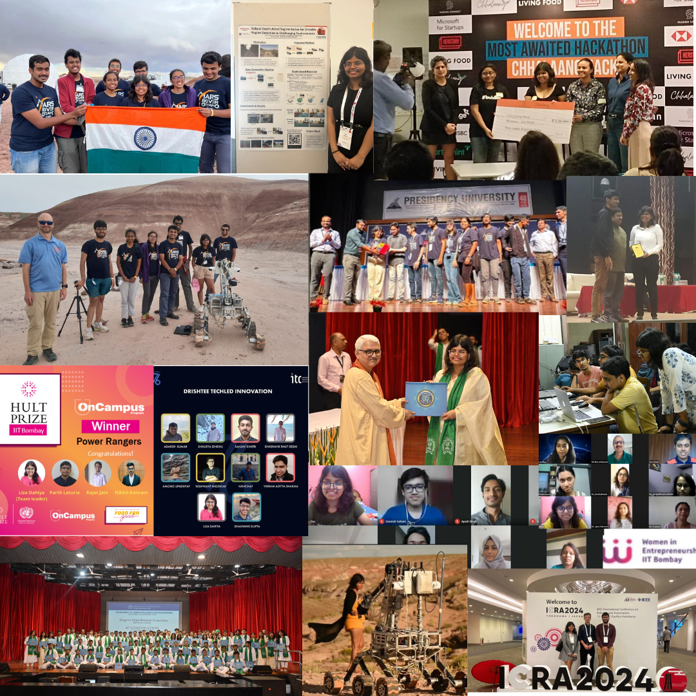

Presently, I'm working as an **AI Research Engineer** at [**Honda RnD**](https://global.honda/jp/RandD/hgsc/) in Tokyo, Japan. My work involves researching and developing vision-based intelligent autonomous robotic systems for new generation of Honda's [Autonomous Work Vehicle](https://www.honda.com/mobility/Autonomous-Work-Vehicle). 

Not so surprisingly, I have a broad range of **research interests**: AI and cognition, AI and neurological disorders, NLP, CV, and Robotics.

I completed my Undergraduate studies in Computer Science & Engineering from IIT Bombay (with Honors). I have been fortunate to work with some really awesome labs throughout my bachelors: [Prof. Abir De](https://scholar.google.com/citations?user=_9ZKKbIAAAAJ&hl=en&oi=ao), [Prof. Christina Chung](https://scholar.google.com/citations?user=8GxDKicAAAAJ&hl=en), and [Prof. Shankaranarayanan S](https://scholar.google.com/citations?hl=en&user=P0F_L70AAAAJ). 

I have been collaborating with **NTU, Sentic Lab** under the mentorship of [Prof. Erik Cambria](https://scholar.google.com/citations?user=ilSYpW0AAAAJ&hl=en) and [Dr. Rui Mao](https://scholar.google.com/citations?user=s_JzI5kAAAAJ&hl=en) for the past year and we have worked on some really cool projects on AI and Healthcare. Please check my Google Scholars / Publications.

Previously, I interned at **Adobe Research** during Summer 2022, where I worked on identifying key moments during a livstream using multi-modal dataset. It has been patented under [US Patent](https://patents.google.com/patent/US20240292046A1/en) (US20240292046A1).

I have varied hobbies and interests and have been part of some impactful ventures including - FeMeal, [IIT Mars Rover Team](https://iitbmartian.github.io/
), Chief Editor, [Bitstream](https://www.cse.iitb.ac.in/csea/event.php?event=17) and the [Lecture Over Latte's, Tokyo](https://www.meetup.com/study-group-cafe-tokyo/). Sometime I also participate in Hackathons!

Finally, if I have any time left, I write some blogs too here: [Medium](https://medium.com/@lizadahiya01) and [Confenssions-of-Teenage-Freak](https://voiceofheartblog.home.blog/). Sometimes, I vlog my time in Tokyo [here](https://www.instagram.com/liza.in.tokyo).

